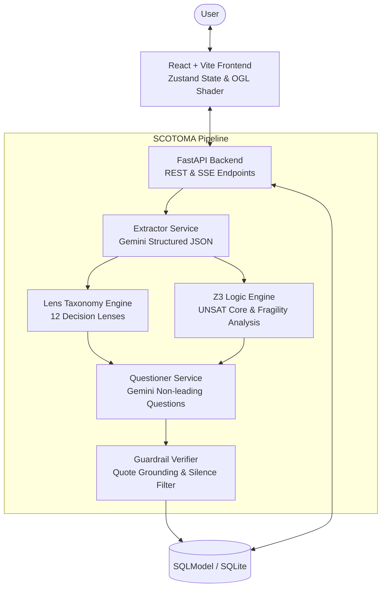

# SCOTOMA — The Blind Spot Analyzer

> *Scotoma (n.): a blind spot in the visual field. The brain fills it in so you never notice it.*

SCOTOMA is a neuro-symbolic decision analysis web application developed for PromptWars "The Blind Spot". It combines Gemini LLMs with the Z3 SMT Theorem Prover to detect unstated assumptions, logical contradictions, and silent decision lenses without ever making a recommendation.

---

## 🏗️ Architecture Diagram



---

## ⚡ Quick Start

### 1. Environment Setup

Copy `.env.example` to `.env` and set your Google Gemini API key:

```bash
cp .env.example .env
```

### 2. Backend Setup

```bash
python -m venv venv
# On Windows (PowerShell):
.\venv\Scripts\Activate.ps1
# On Linux/macOS:
# source venv/bin/activate

pip install -r backend/requirements.txt
```

Run backend server:

```bash
uvicorn app.main:app --app-dir backend --reload --port 8000
```

### 3. Frontend Setup

```bash
cd frontend
npm install
npm run dev
```

Visit [http://localhost:5173](http://localhost:5173) in your browser.

---

## 🧪 Running Tests

### Backend Tests (pytest)
```bash
pytest
```

### Frontend Tests (vitest)
```bash
cd frontend
npm test
```

### Linting
```bash
# Backend lint
ruff check .

# Frontend lint
cd frontend
npm run lint
```

---

## 🛡️ License

MIT License
